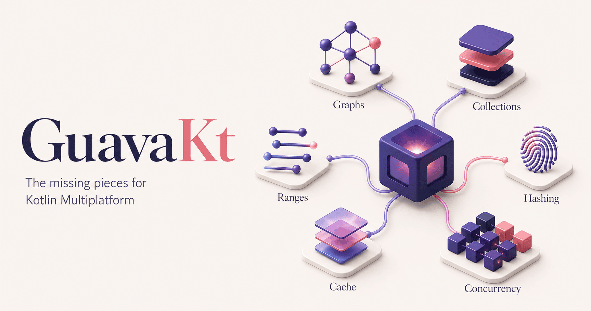

# GuavaKt

**Kotlin Multiplatform primitives for the parts Kotlin’s standard library does not cover.**



GuavaKt brings the portable, high-leverage ideas from Guava to Kotlin: rich collections, ranges,
graphs, hashing, networking helpers, exact math, and coroutine-aware coordination. It is designed
for `commonMain`, written in Kotlin, and uses coroutines and Okio where they are the natural fit.

It is independent of Google, uses `com.bernaferrari.guavakt.*` packages, and is not binary-compatible with
`com.google.guava:guava`. This is a Kotlin-first library, not a line-by-line port of Java-era
Guava.

## Install

```kotlin
implementation("com.bernaferrari.guavakt:guavakt-collect:0.1.0")
```

Choose the module for the capability you need:

| Module | Includes |
|---|---|
| `guavakt-collect` | Multimap, Multiset, BiMap, Table, Range, RangeSet, RangeMap |
| `guavakt-graph` | Graph, ValueGraph, Network, Traverser |
| `guavakt-hash` | Hashing, Hasher, Funnel, BloomFilter |
| `guavakt-net` | IP parsing, HostAndPort, InternetDomainName |
| `guavakt-cache` | Bounded, expiring, coroutine-owned caches |
| `guavakt-concurrent` | Coroutine rate limiting and guarded coordination |
| `guavakt-math` | Primitive/statistical and arbitrary-precision math |
| `guavakt-io` | Okio-native sources, sinks, paths, and filesystem adapters |
| `guavakt` | The umbrella module |

## Use GuavaKt for the missing pieces

| Need | Use |
|---|---|
| One key with many values, counted values, a two-way map, or a table | `Multimap`, `Multiset`, `BiMap`, `Table` |
| Intervals with explicit bounds, disjoint ranges, range-to-value lookup, or huge discrete domains | `Range`, `RangeSet`, `RangeMap`, `ContiguousSet`, `DiscreteDomain.bigIntegers()` |
| Directed or undirected relationships | `Graph`, `ValueGraph`, `Network`, `Traverser` |
| Portable hashes or probabilistic membership | `Hashing`, `Hasher`, `Funnel`, `BloomFilter` |
| IP literals, ports, and registrable domains | `InetAddresses`, `HostAndPort`, `InternetDomainName` |
| A bounded, expiring cache with scoped asynchronous loading | `CacheBuilder.buildCoroutine(scope)` |
| A cancellable rate limit or guarded shared state | `CoroutineRateLimiter`, `CoroutineMonitor` |
| Exact values beyond primitive limits | `BigInteger`, `BigDecimal`, math helpers |

`Range` complements Kotlin ranges rather than replacing them: use `0..10` for an ordinary loop or
membership check; use GuavaKt when boundaries, range algebra, or range collections matter.

## Examples

### One key, several values—without nested collection bookkeeping

```kotlin
import com.bernaferrari.guavakt.collect.ArrayListMultimap

val tagsByProject = ArrayListMultimap.create<String, String>().apply {
    putAll("guavakt", listOf("kotlin", "multiplatform"))
}
tagsByProject["guavakt"] += "coroutines"

val tags = tagsByProject["guavakt"]
// [kotlin, multiplatform, coroutines]
```

`get(key)` is a live value collection: adding through it updates the multimap and its key
bookkeeping. Use an ordinary `Map<K, V>` when each key has one value.

### Merge and query interval collections

```kotlin
import com.bernaferrari.guavakt.collect.Range
import com.bernaferrari.guavakt.collect.TreeRangeSet

val maintenance = TreeRangeSet.create<Int>().apply {
    add(Range.closedOpen(100, 200))
    add(Range.closedOpen(180, 250))
}

val windows = maintenance.asRanges() // one coalesced [100, 250) window
val downAt225 = maintenance.contains(225) // true
val downAt250 = maintenance.contains(250) // false
```

`RangeSet` turns overlapping or touching intervals into disjoint windows. That is where `Range`
earns its place; for a plain loop or simple bound, prefer Kotlin's `0..10` or `0..<10`.

### Hash a domain value without reflection

```kotlin
import com.bernaferrari.guavakt.hash.Funnel
import com.bernaferrari.guavakt.hash.Hashing

data class BuildKey(val branch: String, val revision: String)

val buildKeyFunnel = Funnel<BuildKey> { key, sink ->
    sink.putString(key.branch).putString(key.revision)
}

val fingerprint = Hashing.murmur3_128()
    .hashObject(BuildKey("main", "9d3b6a2"), buildKeyFunnel)
```

Funnels make the byte format and field order explicit, so the same hash is produced on every
target without reflection or JVM serialization.

### Model a directed dependency graph

```kotlin
import com.bernaferrari.guavakt.graph.GraphBuilder

val dependencies = GraphBuilder.directed<String>().build<String>().apply {
    putEdge("app", "domain")
    putEdge("domain", "storage")
}

val appDependencies = dependencies.successors("app")
// [domain]
```

The graph keeps direction, node identity, and edge queries as first-class concepts instead of
encoding them in an incidental `Map<String, Set<String>>`.

### Cache suspending work with an explicit lifetime

```kotlin
import com.bernaferrari.guavakt.cache.CacheBuilder
import kotlinx.coroutines.CoroutineScope
import kotlin.time.Duration.Companion.minutes

data class User(val id: String, val name: String)

class UserRepository(
    scope: CoroutineScope,
    private val fetchUser: suspend (String) -> User,
) {
    private val users = CacheBuilder.newBuilder<String, User>()
        .maximumSize(1_000)
        .expireAfterAccess(30.minutes)
        .buildCoroutine(scope) { id -> fetchUser(id) }

    suspend fun get(id: String): User = users.get(id)
}
```

Give the cache an application or feature scope—not an individual request scope. Same-key misses
share one owner-scoped load; cancelling one caller stops only its wait, while cancelling the owner
scope stops shared work.

## Keep Kotlin and focused libraries for everything else

| Use | Instead of |
|---|---|
| Kotlin `List`, `Set`, `Map`, sequences, nullable types, `require`, and `check` | Guava-style collection factories, `Optional`, and ordinary helpers |
| Kotlin `ClosedRange`, `IntRange`, and `until` | `Range` when a simple interval or loop is enough |
| `kotlinx.coroutines`, `Flow`, `Channel`, `Mutex`, and structured concurrency | Futures, executors, services, blocking queues, or a general-purpose event bus |
| Okio `FileSystem`, `Path`, `Source`, `Sink`, and `ByteString` | A `java.io` or `java.nio.file` façade |
| Caffeine on the JVM | GuavaKt cache when peak local-cache throughput is the only goal |

GuavaKt deliberately does not include Java reflection or proxies, `ListenableFuture`, executors,
services, EventBus, blocking queues, or a `java.io`/`java.nio.file` facade.

## Documentation

- [Compatibility matrix](docs/compatibility.md) — supported concepts and intentional differences
- [Kotlin-first guide](docs/kotlin-first.md) — choosing Kotlin, coroutines, Okio, or GuavaKt
- [Architecture](docs/architecture.md) — modules and targets
- [Stability policy](docs/stability.md) and [changelog](CHANGELOG.md)
- [Documentation index](docs/README.md) — benchmarks, fuzzing, public-suffix refreshes, and releases
- [Contributor guide](AGENTS.md) — project conventions and verification commands
