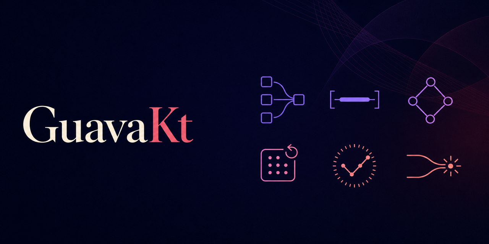

# GuavaKt

**The useful parts of Guava, designed for Kotlin Multiplatform.**

GuavaKt supplies the data structures and utilities that Kotlin's standard library deliberately does
not: multimaps, multisets, ranges, graphs, caches, hashing, public-suffix and networking helpers,
Okio-native I/O, and coroutine-friendly coordination. It is written for `commonMain` first and
keeps JVM-only facilities visibly JVM-only.



> **Early alpha.** GuavaKt is an independent project, not an official Google product. It is not a
> binary-compatible or drop-in replacement for `com.google.guava:guava`; its packages are
> `dev.guavakt.*`. Every public surface has an explicit compatibility tier in
> [compatibility matrix](docs/compatibility.md).

## Why use it?

Use GuavaKt when the capability matters across JVM, JS, Wasm, and Native—not because a Java API
has a familiar name.

| If you need… | Use… |
|---|---|
| One key associated with many values | `Multimap`, `ListMultimap`, `SetMultimap`, `Multiset`, `BiMap`, or `Table` |
| Intervals, disjoint ranges, or an arbitrary-precision discrete domain | `Range`, `RangeSet`, `RangeMap`, `ContiguousSet`, and `DiscreteDomain.bigIntegers()` |
| Mutable or immutable dependency/data graphs | `Graph`, `ValueGraph`, `Network`, `Graphs`, and `Traverser` |
| A bounded, expiring, observable in-memory cache | `CacheBuilder.buildCoroutine(scope)` |
| Stable hashing or portable probabilistic membership | `Hashing`, `Hasher`, `Funnel`, and `BloomFilter` |
| Exact numbers outside primitive limits | `BigInteger`, `BigDecimal`, `MathContext`, and Guava-shaped math helpers |
| Sources, sinks, files, or stream hashing in common code | `ByteSource`, `CharSource`, `ByteSink`, `CharSink`, and injected Okio `FileSystem` |
| A rate limit or guarded state without blocking a thread | `CoroutineRateLimiter` and `CoroutineMonitor` |
| Migration from Guava | Compatibility shims for familiar concepts, followed by Kotlin simplification |

For ordinary `List`, `Set`, `Map`, `map`/`filter`, nullable values, and asynchronous work, prefer
the Kotlin standard library, `T?`, and `kotlinx.coroutines`. GuavaKt does not try to replace them.

## Availability

GuavaKt is an early alpha and release artifacts are not available yet. Evaluate it from source for
now; a tagged public release will document the supported dependency coordinates. The `guavakt`
umbrella module is useful for exploration, while applications should eventually select only the
modules they use.

### A real multimap

```kotlin
import dev.guavakt.collect.ArrayListMultimap

val tags = ArrayListMultimap.create<String, String>()
tags.put("kotlin", "multiplatform")
tags.put("kotlin", "coroutines")

val kotlinTags = tags["kotlin"] // [multiplatform, coroutines]
```

### A cache that belongs to a coroutine scope

```kotlin
import dev.guavakt.cache.CacheBuilder
import kotlin.time.Duration.Companion.minutes

val users = CacheBuilder.newBuilder<UserId, User>()
    .maximumSize(1_000)
    .expireAfterAccess(30.minutes)
    .refreshAfterWrite(5.minutes)
    .recordStats()
    .buildCoroutine(applicationScope) { id -> api.fetchUser(id) }

val user = users.get(id) // suspends; concurrent misses for one key share one load
```

The supplied scope owns shared loading work. Cancelling one caller stops only that wait; cancelling
the scope stops the cache's owned work. The synchronous Guava-shaped builder is retained for
migration, but new KMP code should use `buildCoroutine`.

### Portable exact arithmetic

```kotlin
import dev.guavakt.math.BigDecimal
import dev.guavakt.math.BigInteger
import dev.guavakt.math.MathContext

val total = BigInteger.parse("123456789012345678901234567890")
val price = BigDecimal.parse("19.995")
val rounded = price.multiply(BigDecimal.parse("1.21"), MathContext.DECIMAL64)

val bits = total.bitLength() // 97
val display = rounded.toPlainString() // "24.19395"
```

`BigInteger` covers arithmetic, radix and signed-byte conversion, two's-complement bit operations,
modular arithmetic, roots, and probable-prime utilities. `BigDecimal` retains scale and supports
exact/rounded division, `MathContext`, point movement, engineering/plain rendering, square roots,
and exact `Double` construction. These are common immutable value types—not `java.math` wrappers.

## What is implemented

| Area | What matters in practice |
|---|---|
| Collections | Multimap, Multiset, BiMap, Table, immutable/sorted variants, class-to-instance maps, forwarding decorators, ordering, and traversal |
| Ranges | `Range`, `RangeSet`, `RangeMap`, live mutable views, immutable variants, canonical discrete ranges, and arbitrary-precision `ContiguousSet` domains |
| Graph | `Graph`, `ValueGraph`, `Network`, builders, element order, copy/transpose/closure utilities, and lazy tree traversal |
| Cache | Size/weight eviction, expiry, refresh, stats, removal listeners, bulk loading, deterministic clocks, and coroutine load coalescing |
| Hash | Murmur3, SHA-2/HMAC, CRC32, Adler32, SipHash, FarmHash/Fingerprint2011, hash composition, Okio hashing streams, and Guava-wire-compatible Bloom filters |
| Base and escape | Preconditions, Optional migration shim, Joiner, Splitter, CharMatcher, converters, equivalence, suppliers, strings, escapers, and public-suffix lookup |
| I/O and net | Okio-native sources/sinks, byte-array data I/O, injected filesystems, host/port and IP-literal helpers |
| Concurrent | Coroutine rate limiting, monitor, time limiting, scheduled work, services, future/deferred bridges, plus JVM blocking migration APIs |
| Math | Primitive math, statistics, quantiles, `BigInteger`, `BigDecimal`, and `BigDecimalMath.roundToDouble` |

The project directly compares high-value behavior and failures with pinned Guava 33.6 on the JVM;
the exhaustive detail and deliberate KMP differences are in the [compatibility matrix](docs/compatibility.md). The short
version is: core capabilities are substantial, while Java serialization, Java generic-reflection
identity, and binary linkage to Guava are intentionally not promised.

## Kotlin-first by design

- **Coroutines over thread blocking.** `CoroutineRateLimiter`, `CoroutineMonitor`, `Flow`,
  suspending waits, and explicit scope ownership are the primary API. Futures and blocking waits
  exist for migration only.
- **Okio over fake portable `java.io`.** Filesystem use takes an Okio `FileSystem` and `Path` so a
  test, browser, and native application can choose their real storage boundary honestly.
- **Kotlin values over Java compatibility theatre.** Kotlin nullability and collection types are
  retained where they make the API safer. Immutable compatibility types are deep snapshots, not
  mutable collections hidden behind a read-only interface.
- **Honest platform tiers.** Weak references, classpath scanning, dynamic proxies, real blocking,
  and system filesystems are documented per target instead of silently emulated.

Read the [Kotlin-first guide](docs/kotlin-first.md) for the boundary and migration guidance.

## Confidence and verification

The reference toolchain is JDK 17, Kotlin 2.4.10, and the checksum-pinned Gradle 9.6.0 wrapper.

```bash
./gradlew apiCheck jvmTest :guavakt-parity:test dokkaGenerate --no-daemon
python3 scripts/hollow_inventory.py
python3 scripts/depth_inventory.py
python3 scripts/count_tests.py
python3 scripts/immutable_audit.py
```

The tests include direct Guava/JDK differentials, deterministic concurrent traces, and
arbitrary-precision fuzzing. Increase its replay budget when changing numeric or range code:

```bash
./gradlew :guavakt-parity:test --no-daemon -Pkotlin.incremental=false \
  -PfuzzSeeds=128 -PfuzzCases=1024
```

Reproducible JMH workloads cover cache hot/miss/eviction paths, graph construction/reachability/
mutation, and hash one-shot/streaming paths. See [benchmark guidance](docs/benchmarks.md).

## Documentation

The [documentation index](docs/README.md) separates reader guidance from maintainer references.
The most useful starting points are:

- [Compatibility matrix](docs/compatibility.md) — evidence tiers and deliberate KMP differences
- [Kotlin-first guide](docs/kotlin-first.md) — when Kotlin or coroutines are the better API
- [Architecture](docs/architecture.md) — module DAG and platform policy
- [Roadmap](docs/roadmap.md) — current priorities and definition of done

## What GuavaKt does not claim

It does not promise source or binary compatibility with Guava, Java serialization formats, a full
`java.lang.reflect.Type` system on non-JVM targets, or JDK-specific `BigInteger`/`BigDecimal`
allocation and serialization behavior. The portable numeric values intentionally exclude Java
constructors and `Random`/serialization interop, while preserving the operations a KMP caller can
meaningfully use. If a behavior depends on JVM garbage collection, a `ClassLoader`, a Java proxy,
or a blocking thread, check the relevant row in the [compatibility matrix](docs/compatibility.md) before relying on it.

Maven Central publication is configured but not yet performed: the release owner must provide the
verified `dev.guavakt` namespace, Central token, signing key, and public source URL.
