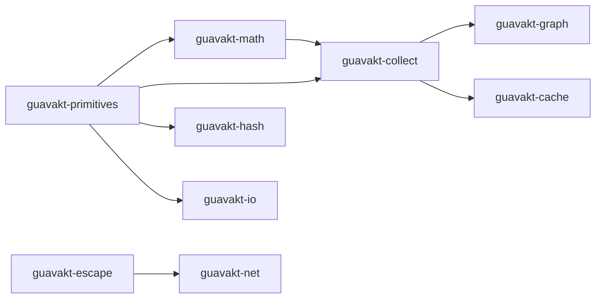

# GuavaKt architecture

| Field | Value |
|---|---|
| Maturity | 0.1.0 |
| Group | `com.bernaferrari.guavakt` |
| Version | `0.1.0` |
| Targets | JVM, JS IR, Wasm JS, iOS, macOS, Linux x64, Mingw x64 |
| License | Apache-2.0 with Guava attribution |

GuavaKt is a Kotlin-first Multiplatform implementation of selected Guava-shaped concepts. It is neither a source transcription nor a binary replacement for Guava. Public packages deliberately use `com.bernaferrari.guavakt.*`, so GuavaKt and Guava can coexist on the JVM for differential tests and migration.

## Product boundary

Kotlin stdlib owns ordinary List/Set/Map factories, read-only collection interfaces, nullable values, and collection transformations. `kotlinx.coroutines` remains the primary asynchronous model. GuavaKt invests in concepts without a comparable common Kotlin facility: Multimap, Multiset, BiMap, Table, Range, Graph, Cache, hashing, public-suffix utilities, escapers, coroutine rate limiting, and guarded coordination.

Compatibility means tested behavioral familiarity, not identical overload breadth, Java serialization, implementation classes, exception text in every path, or private data layout. The detailed evidence levels are in the [compatibility matrix](compatibility.md).

## Module dependency map

Shared foundations, the standalone `guavakt-concurrent`, and the all-in-one `guavakt` umbrella are omitted for clarity.

## Platform policy

Production code belongs in `commonMain` unless it requires a real platform facility. `expect`/`actual` is reserved for:

- clocks and timers;
- weak/soft reference support and GC queues.

When a target cannot implement a semantic safely, the API reports the limitation or throws `UnsupportedOperationException`. Busy loops, mutable stand-ins named `Immutable`, and unrelated collection-backed placeholder types are prohibited.

| Capability | JVM | JS / Wasm / Native |
|---|---|---|
| Pure algorithms/collections | common implementation | common implementation |
| Cache synchronization | common coroutine facade | common coroutine facade uses `Mutex`, explicit scope ownership, and per-key shared work |
| Guarded synchronization | common `CoroutineMonitor` | `CoroutineMonitor` uses `Mutex` and state-change wakeups; it does not emulate JVM blocking monitors |
| Weak/soft references | GC-backed | strong holder with capability flag |
| Filesystem storage | injected Okio `FileSystem` + `Path` | injected Okio `FileSystem` + `Path`; fake/in-memory implementations are portable |
| Reflection/proxies/executors | not part of the product | not part of the product |

## Contract policy

1. Public `Immutable*` types expose read-only Kotlin interfaces or throw on every mutation path, including iterators, entries, sublists, and inverse views.
2. Live collection views must maintain parent bookkeeping when changed through `keys`, `values`, `entries`, `asMap`, sublists, or inverse maps.
3. Guava parity claims require typed oracle tests that run both implementations. Class availability and source-file counts are inventory evidence, not behavior evidence.
4. Platform limitations belong in KDoc and the README compatibility matrix.
5. No package or coordinate may claim `com.google.common`; GuavaKt does not promise binary compatibility.

## Quality and release gates

The required JVM/oracle and static checks are documented in [`CONTRIBUTING.md`](../CONTRIBUTING.md). CI additionally runs JS Node, Wasm Node, and Linux x64 test task sets; checks saved JVM/KLib API descriptions; generates aggregated Dokka; and builds local Maven publications.

The build is wired for signed Maven Central Portal publication. Upload still requires a verified
namespace, owner credentials, and a signing key; see [release guidance](releasing.md).
