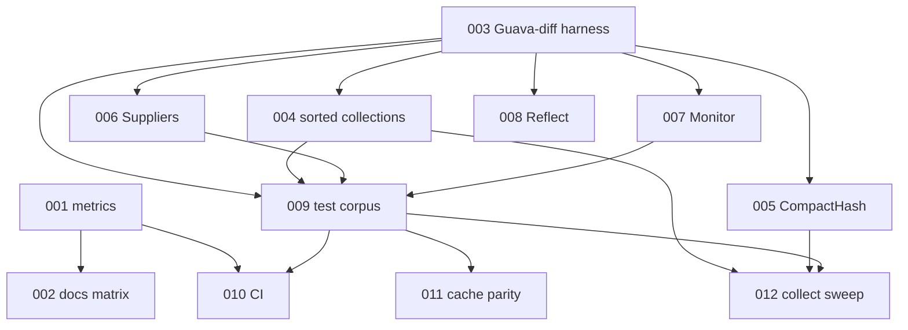

# Implementation Plans — GuavaKt → 9 / 9 / 9

Generated by the improve skill on **2026-06-28**. Target scores after all plans land:

| Dimension | From | To | Primary plans |
|-----------|------|-----|----------------|
| Architecture | ~8.5 | **9** | 001, 002, 010 |
| Behavioral fidelity | ~5.5 | **9** | 003–008, 011–012 |
| Test maturity | ~3.5 | **9** | 003, 009, 010 |

Execute in numeric order unless dependencies say otherwise. Each executor: read the plan fully, honor STOP conditions, update your row when done.

**Repo note:** Workspace may not be a git repo; drift checks use file content vs plan excerpts. If git appears later, use `git rev-parse --short HEAD` in commits.

**Verification baseline (all plans):**
```bash
./gradlew jvmTest --no-daemon
python3 scripts/hollow_inventory.py   # expect TOTAL_HOLLOW=0 (or updated script exit 0)
```

## Execution order & status

| Plan | Title | Priority | Effort | Depends on | Status |
|------|-------|----------|--------|------------|--------|
| 001 | Add depth/fidelity metrics gate (beyond hollow) | P1 | M | — | DONE |
| 002 | Compatibility matrix + README maturity bar | P1 | S | 001 | DONE |
| 003 | JVM Guava differential test harness | P1 | L | — | DONE |
| 004 | Sorted collections fidelity (TreeMap/TreeSet semantics) | P1 | L | 003 | DONE |
| 005 | CompactHash\* real open-addressing (or slim APIs) | P2 | L | 003 | DONE |
| 006 | Deepen base utilities (Suppliers + peers) | P1 | M | 003 | DONE |
| 007 | Concurrent Monitor/waits cooperative fidelity | P1 | L | 003 | DONE |
| 008 | Reflect tiering + TypeToken depth on JVM | P2 | L | 003 | DONE |
| 009 | Characterization test corpus (≥800 tests) | P1 | L | 003, 004, 006, 007 | DONE |
| 010 | CI multiplatform compile + gates + coverage | P1 | M | 001, 009 | DONE |
| 011 | LocalCache / MapMaker parity suite | P1 | L | 003, 009 | DONE |
| 012 | Collect core depth sweep (thin → okish) | P2 | L | 004, 005, 009 | DONE |

Status values: `TODO` | `IN PROGRESS` | `DONE` | `BLOCKED (reason)` | `REJECTED (reason)`

## Dependency graph



## Dependency notes

- **003 first among fidelity work** — differential harness catches regressions while 004–008 deepen implementations.
- **001 before 010** — CI must run the new depth gate.
- **009 after 004/006/007** — corpus assumes sorted/suppliers/monitor contracts exist; partial 009 OK earlier but done criteria need those APIs.
- **012 last** — uses metrics from 001 and corpus from 009 to prioritize remaining thin stems.

## Target metrics (definition of 9/9/9)

Machine-checkable targets written into 001 and enforced by 010:

| Metric | Target for “9” |
|--------|----------------|
| `TOTAL_HOLLOW` | 0 |
| Stems with depth tier **DEEP** or **OK** | ≥ 85% of 610 (~519) |
| Stems tier **THIN** or **SHELL** | ≤ 15% |
| JVM unit tests in GuavaKt modules | ≥ **800** (`jvmTest` test count) |
| Guava-diff suite (plan 003) shared cases | ≥ **200** assertions, 0 failures on DEEP types |
| Sorted types ordering tests | 100% pass (plan 004) |
| CI | jvmTest + hollow + depth gate + compileKotlinJs for all portable modules + at least one `jsTest` or `linuxX64Test` smoke |
| README | compatibility matrix + “not Guava-compatible” banner |

## Findings considered and rejected

- **Bit-identical heap / serialization with Guava JAR**: rejected — DESIGN.md non-goal; KMP cannot guarantee.
- **Full Mozilla PSL live download at runtime**: rejected — Guava embeds data; we already port trie data.
- **Replacing kotlinx.coroutines**: rejected — DESIGN non-goal.
- **Publishing to Maven Central in these plans**: deferred — SNAPSHOT + matrix only; release credentials are operator-owned.
- **Porting all 52k LOC of guava-tests**: rejected as single PR; 009 selects high-value suites instead.

## How to execute

For each plan: spawn an implementer (or run manually) with only that plan file. Prefer worktree isolation. After each plan: `./gradlew jvmTest` and update this README row to `DONE`.

## Wave 2 (2026-07-01) — toward 9/10 product maturity

Landed in-tree (not as separate plan files):

- Wrong-kind `Immutable*` → read-only contracts + `scripts/immutable_audit.py`
- `AbstractFuture` / `SettableFuture` / expanded `Futures` composition
- `TypeToken` depth + platform hierarchy
- Required Guava oracle in `guavakt-parity` (`OracleCompareTest` fails closed)
- Test floor raised to **1000** `@Test` methods
- `LICENSE` / `NOTICE` / `AGENTS.md` / maven-publish / native compile CI smoke
- Identity hash map + synchronized map stand-ins in `Maps`
